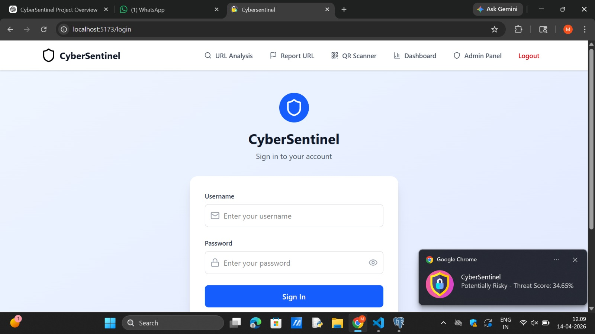
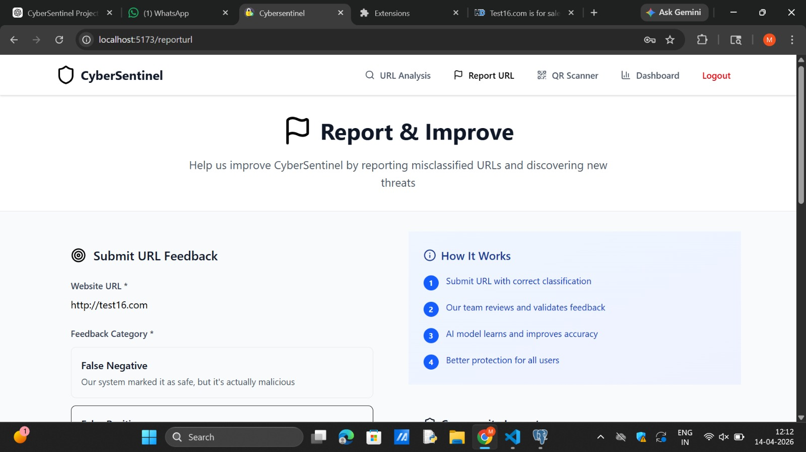
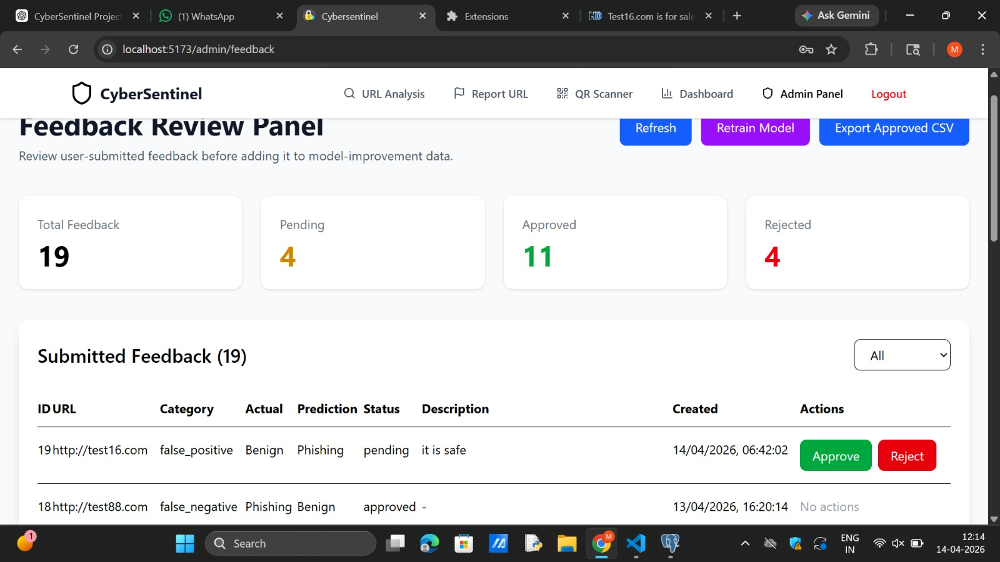
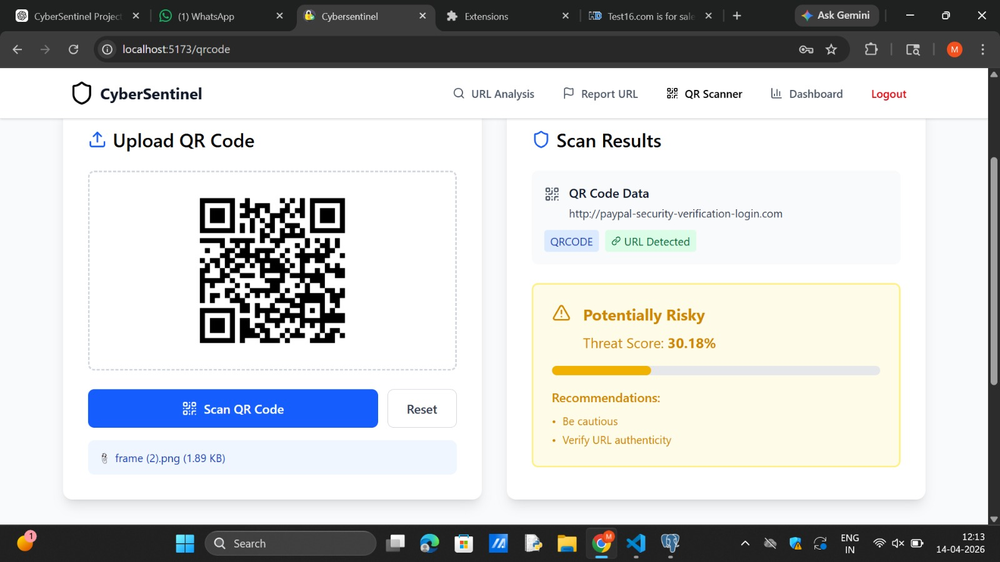
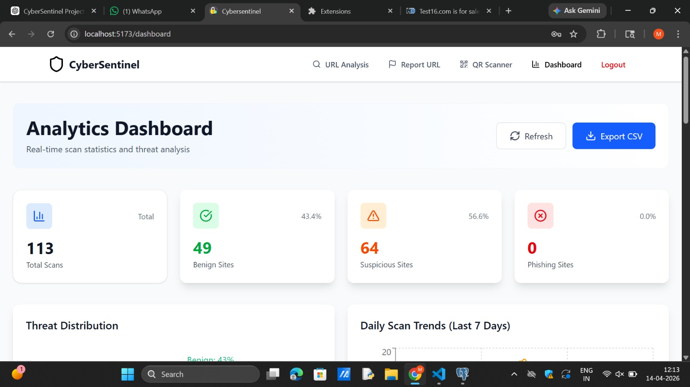
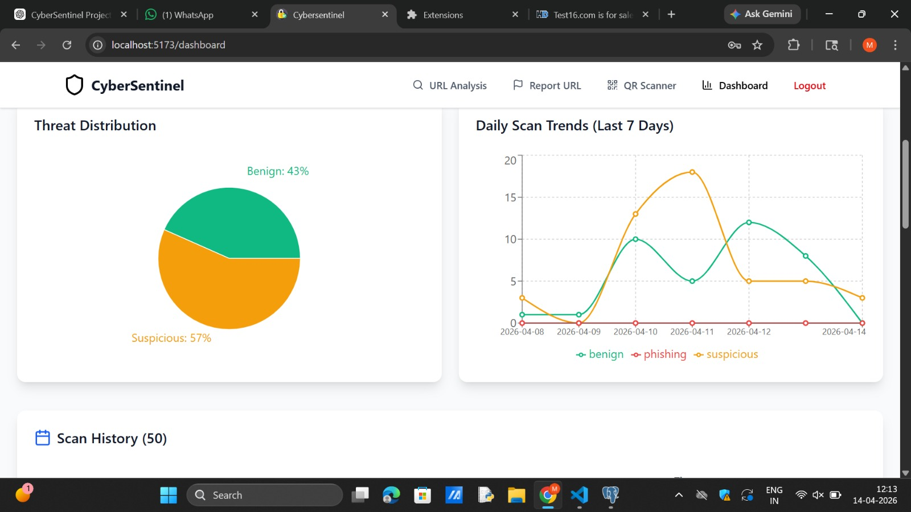

#  CyberSentinel – AI-Powered Phishing Detection System

CyberSentinel is a full-stack cybersecurity web application that detects malicious URLs using a hybrid approach combining:

-  Machine Learning (Random Forest)
-  VirusTotal API
-  Content Analysis
-  Community Feedback + Retraining

It also includes a Chrome Extension for real-time protection.

---

###  Login Page


###  Home Page




###  feedback review panel



###  QR Detection



###  URL Analytics



###  Analytics using visual representation



---


## Features

- Real-time URL phishing detection
- Hybrid analysis (ML + API + Content)
- Admin panel for feedback review
- Model retraining system
- Chrome extension integration
- JWT-based authentication
- QR embedded URl analysis

---

##  Tech Stack

**Frontend**
- React (Vite)
- Tailwind CSS

**Backend**
- Flask (Python)
- Flask-JWT-Extended

**Machine Learning**
- scikit-learn
- pandas, numpy

**Database**
- SQLite / PostgreSQL

---

##  Installation Guide

### 1. Clone the Repository

```bash
git clone https://github.com/yourusername/CyberSentinel.git
cd CyberSentinel
cd backend
```

# Windows
```
python -m venv venv
venv\Scripts\activate
```

# Mac/Linux
```
python3 -m venv venv
source venv/bin/activate

```

# Dependencies:
```
pip install -r requirements.txt
```
# Download Dataset & Train Model:
```
python ml/download_dataset.py
python ml/train_model.py

```
## Add Environment Variables
**Create a .env file inside the backend folder:**
```
VIRUSTOTAL_API_KEY=your_api_key_here
SECRET_KEY=your_secret_key
```
Get VirusTotal API key from: https://www.virustotal.com/gui/join-us


# Start Backend Server
```
python app.py
```
Backend will run on:
 http://localhost:5000

 Frontend Setup
# Open New Terminal & Navigate to Root
```
cd ..
```
# Install Dependencies
```
npm install
```
# Start Frontend
```
npm run dev
```

Frontend will run on:
   http://localhost:5173


# Chrome Extension Setup
Open Chrome and go to:
   chrome://extensions/
Enable Developer Mode
Click Load Unpacked
Select the extension folder from this project

# Default Admin Login
Username: admin
Password: admin123


## How it works 
1. User enters a URL or visits a website
2. Extension / frontend sends URL to backend
3. **Backend performs:**
   - ML prediction
   - VirusTotal check
   - Content analysis
4. Results are combined into a threat score
5. Final verdict is returned (Benign / Suspicious / Phishing)

# Model Retraining
- Users submit feedback
- Admin approves feedback
- Approved data is added to dataset
- Model is retrained using:
- POST /api/admin/retrain-model


## Authors
**Connect with Us**:

**Mohataseem Khan**
 [LinkedIn](https://www.linkedin.com/in/mohataseem-khan/) • [GitHub](https://github.com/Mohataseem89)

 **Rehan Khan**
 [LinkedIn](https://www.linkedin.com/in/rehan-khan-5460b6352/) • [GitHub](https://github.com/RehanKhan1704)
 
 **Saad Shaikh**
 [LinkedIn](https://www.linkedin.com/in/saad-shaikh-1b9265259/) • [GitHub](https://github.com/SS07158)

 **Ansari Husain**
  [LinkedIn](https://www.linkedin.com/in/husain-ansari-7530572bb/) • [GitHub](https://github.com/71-husain)

 


   
